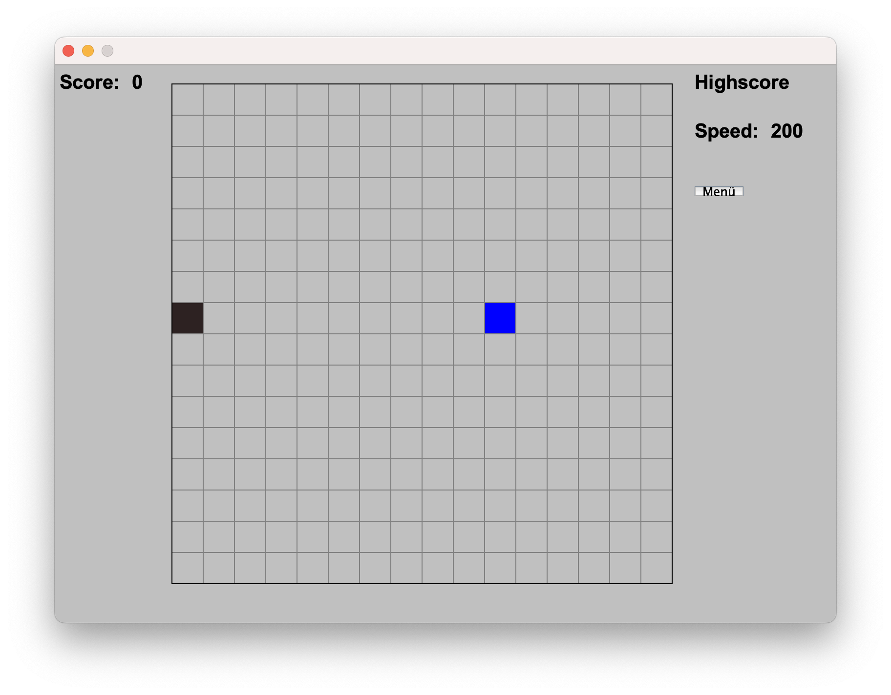
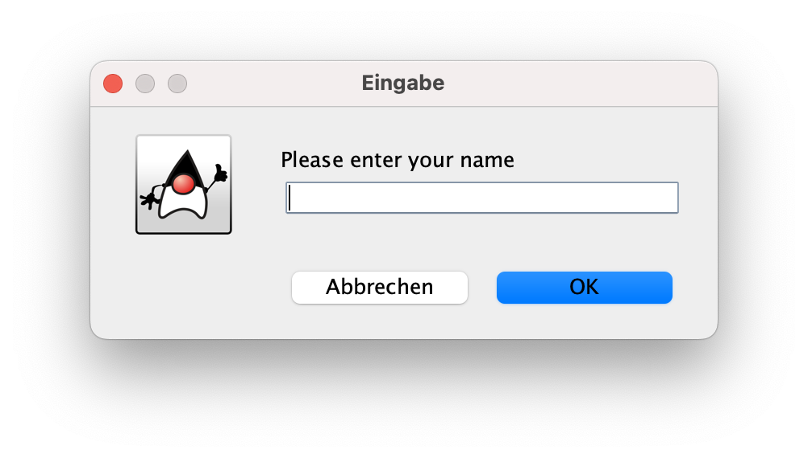
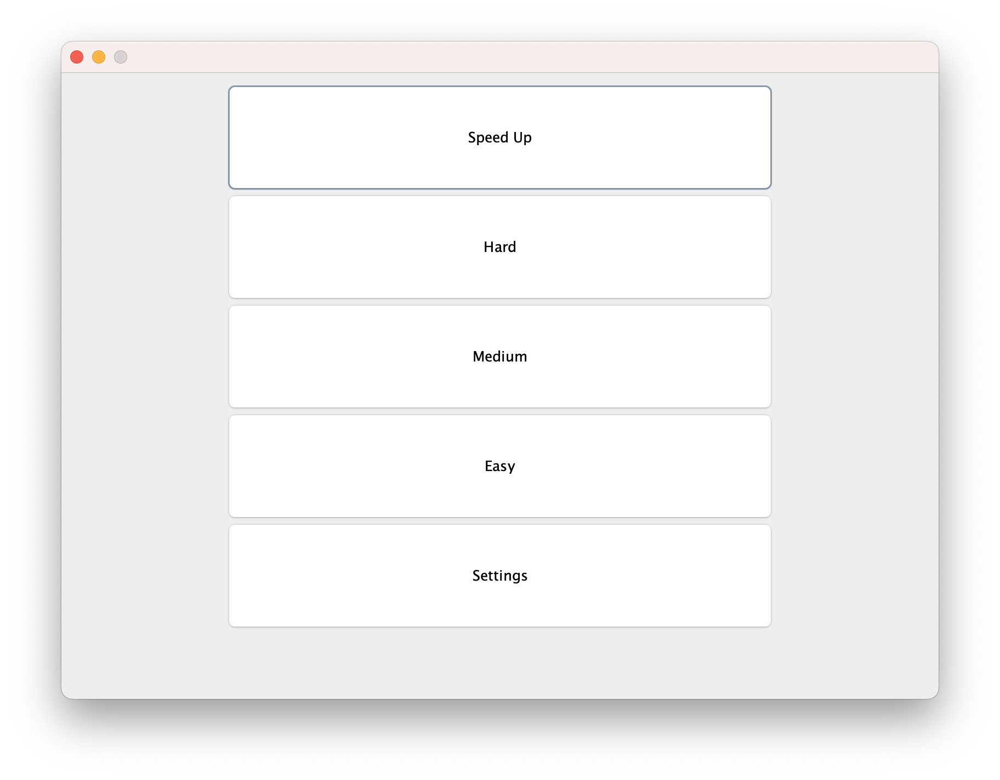

  
  
  

# Snake

I made a version of the game "snake" when I was in school, and now I'm studying computer science, I've tried again and this is the result.

## Features
In my project I have implemented different modes and features.
- You have 3 different difficulty levels with different level of speed.
  - Easy: Time to sleep between movement in millis: 200
  - Medium: Time to sleep between movement in millis: 150
  - Hard: Time to sleep between movement in millis: 100
- You have the mode "Modus" where the speed increase (time to sleep between movement in millis goes down).
- You have a menu interface where you can change the game mode or difficulty.
- You have a setting section, where you can change the volume of the music.
- Saving Highscore:
  - 

## Technologies used
-Java
-Javafx
-MYSQL-Database

## Photos

