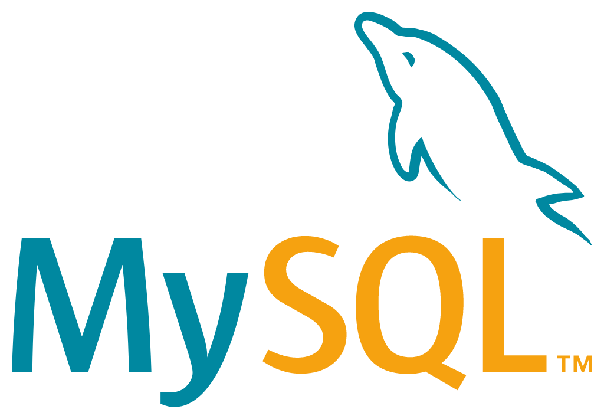

  
  
  

# Snake

I made a version of the game "snake" when I was in school, and now I'm studying computer science, I've tried again and this is the result.

## Features
### Game Modes
In my project I have implemented three different modes with different difficulty levels / different levels of speed.
- Easy: Time to sleep between movement in millis: 200
- Medium: Time to sleep between movement in millis: 150
- Hard: Time to sleep between movement in millis: 100
- "Modus" where the speed increase (time to sleep between movement in millis goes down).

There's a menu interface where you can change the game mode or difficulty.

### Settings
You have a setting section, where you can change the volume of the music.

### High Score
If you break the high score the game will overwrite the old score and you can enter your name.

## Persistence / Database
The high scores for the different modes and difficulty levels are stored in a database.
The application retrieves the high score from the database and if a player should break the score,
a window appears in which the player can enter their name.
The old high score will then be overwritten in the database.

I run the database locally in a Docker container.
To set everything up, do the following:

### Setup Docker
- Create an account on https://hub.docker.com
- Download Docker for your operating system
- Run Docker
- Create an image / server
    - Open a terminal or command line
    - Login to your Docker account with the command line using `docker login`
    - You will be asked for your username and password
    - Execute `docker run --name some-mysql -p 3306:3306 -e MYSQL_ROOT_PASSWORD=my-secret-pw -d mysql`
    - The command will run an existing container or download a fresh one
    - "some-sql" is the name of the image and can be changed as well as the password "my-secret-pw"
    - You can also download the image via the Docker pull command you can find on their website
    - When the installation of the image is finished you can check the status witch `docker ps`
    - Now you should connect with the image via MySQL-Workbench and Java

### Create Schema
Create all the necessary tables

`CREATE TABLE HighscoreLeicht (Name varchar(15) DEFAULT NULL, Score int NOT NULL DEFAULT '0')`

`CREATE TABLE HighscoreMittel (Name varchar(15) DEFAULT '0', Score int NOT NULL DEFAULT '0')`

`CREATE TABLE HighscoreModus (Name varchar(15) DEFAULT NULL, Score int NOT NULL DEFAULT '0')`

`CREATE TABLE HighscoreSchwer (Name varchar(15) DEFAULT NULL, Score int NOT NULL DEFAULT '0')`

## Technologies used
- Java
- Javafx
- MYSQL-Database
- Docker

## Photos

